# KaseiCoinTokenCrowdsale

In this assignment a new cryptocurrency named KaseiCoin is created for a fictional new monetary system focused around a Mars ERC20 token. The main smart contract consists of a deployer with two smart contracts within: a crowdsale contract and a contract creating the KaseiCoin. The contracts satisfy ERC20 requirements using OpenZeppelin. The folder, Evaluation Evidence, contains images depicting the deploying of each contract, as well as evidence of the creation of the coin and the execution of the crowdsale.

### The steps for this assignment are divided into the following subsections:

1. Create the KaseiCoin Token Contract

2. Create the KaseiCoin Crowdsale Contract

3. Create the KaseiCoin Deployer Contract

4. Deploy and Test the Crowdsale on a Local Blockchain

# Evaluation Evidence

### Step 1:  Create the KaseiCoin Token Contract

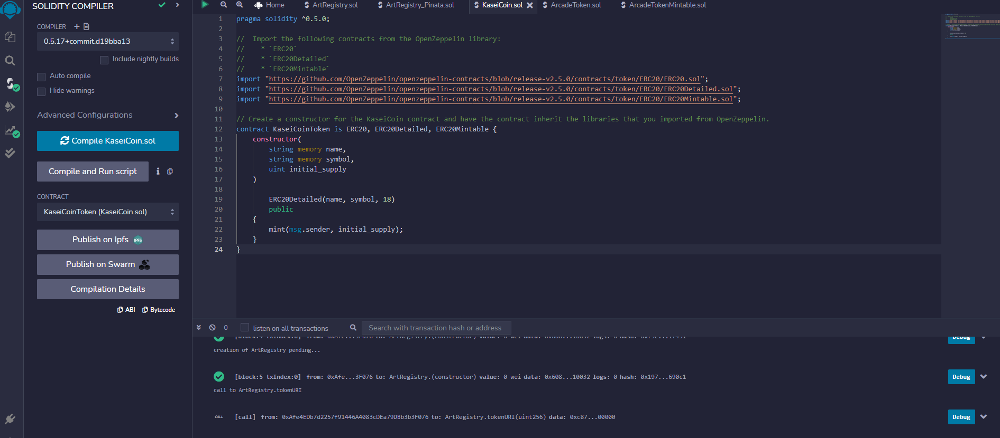

### Step 2:  Create the KaseiCoin Crowdsale Contract

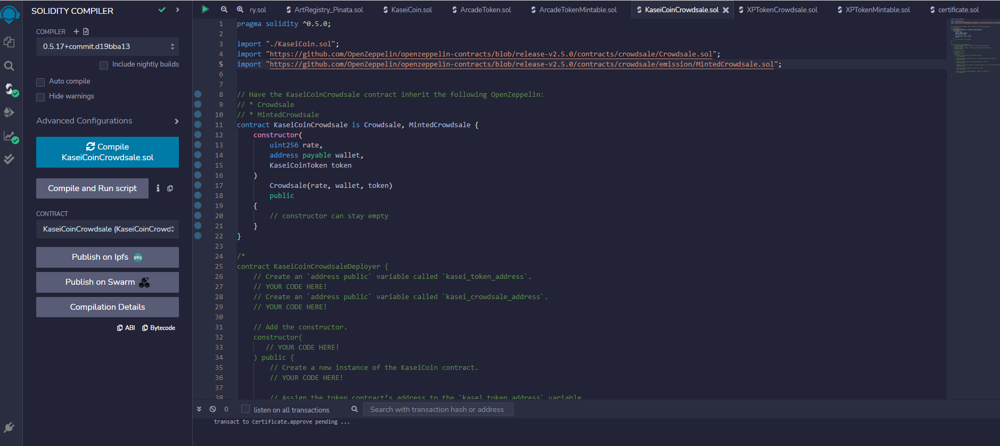

### Step 3:  Create the KaseiCoin Deployer Contract

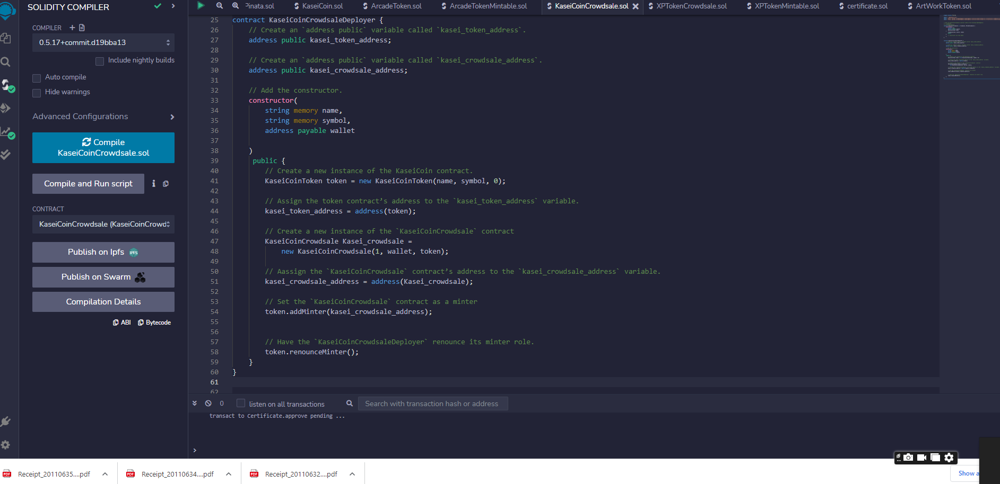

### Step 4:  Deploy and Test the Crowdsale on a Local Blockchain

a. Deploy the Crowdsale Deployer by using Remix, MetaMask, and Ganache.

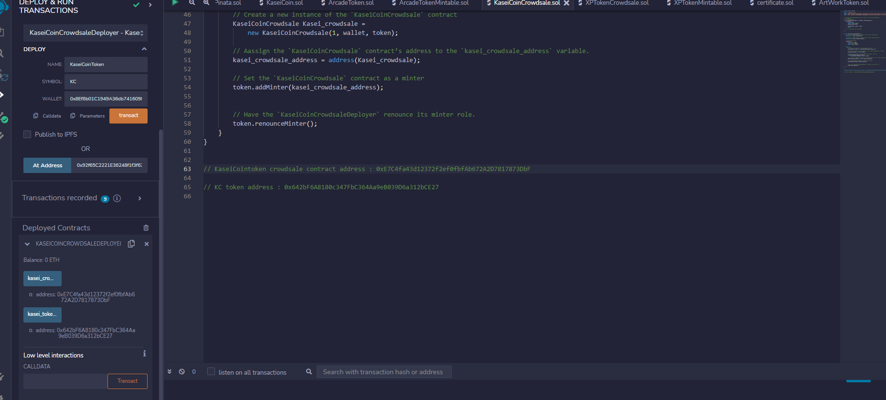

b. Deploy the KasieCoinCrowdsale token

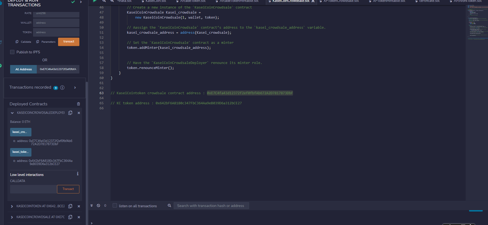

c. Deploy the KasieCoin token

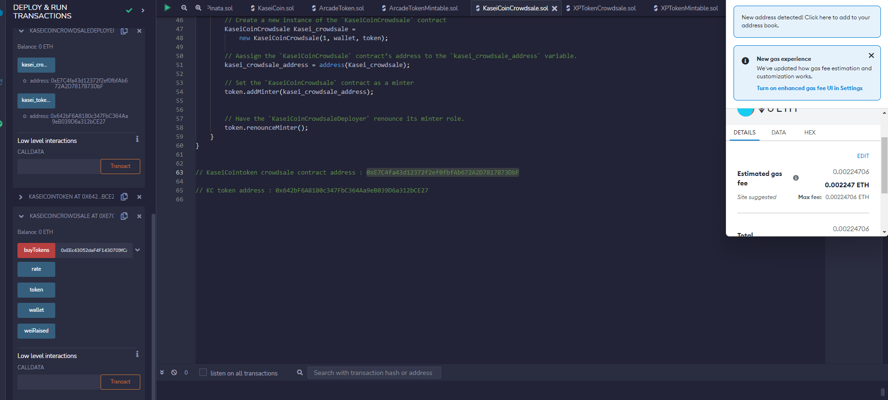

d. Review the total supply of minted tokens and the amount of wei that the crowdsale contract has raised

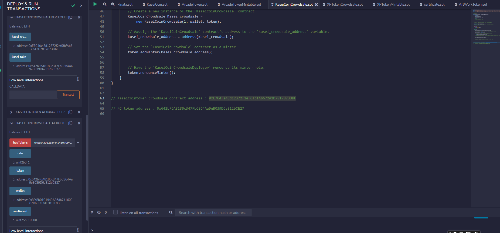

e. Ganache Verification

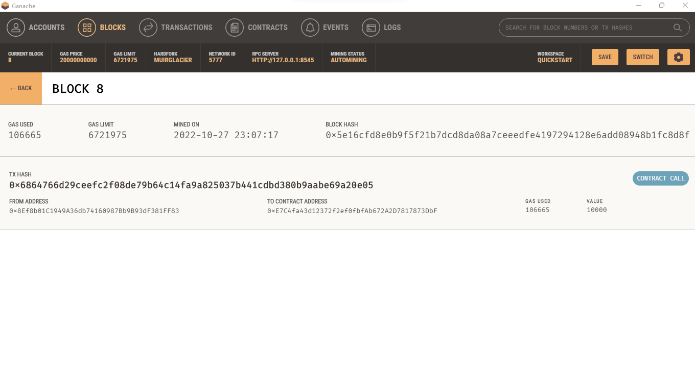

# Optional Excercise : Extend the Crowdsale Contract by Using OpenZeppelin

### Step 1: 

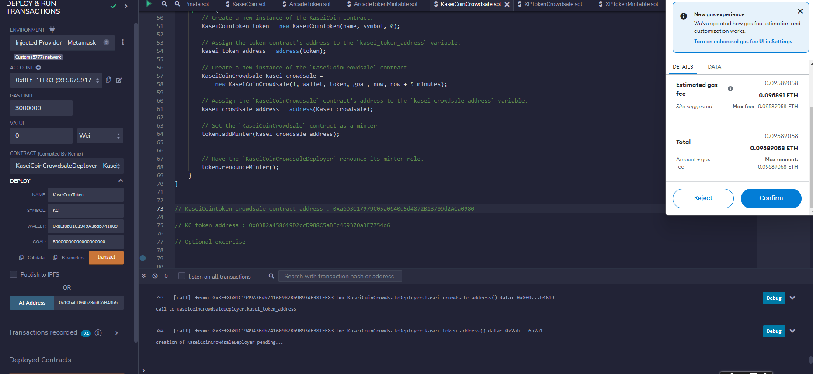

### Step 2:

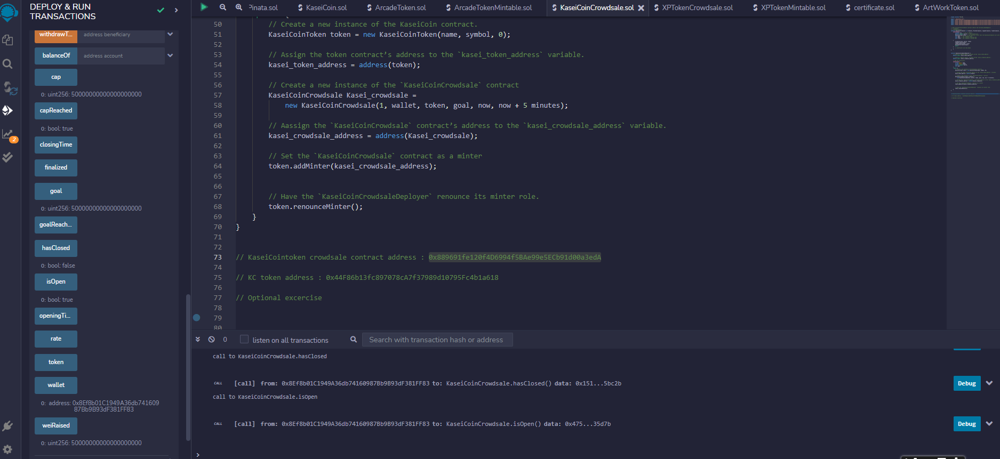

### Step 3:

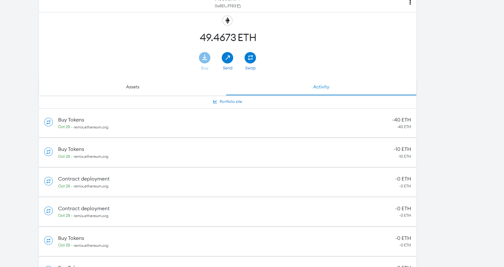

